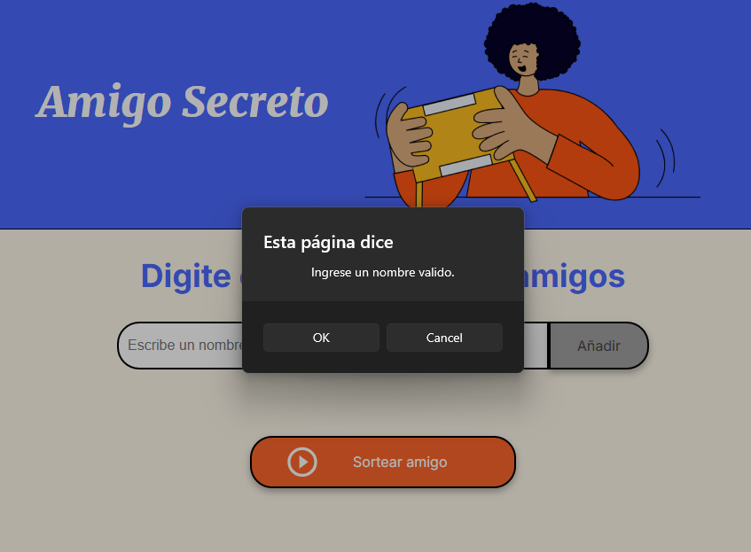
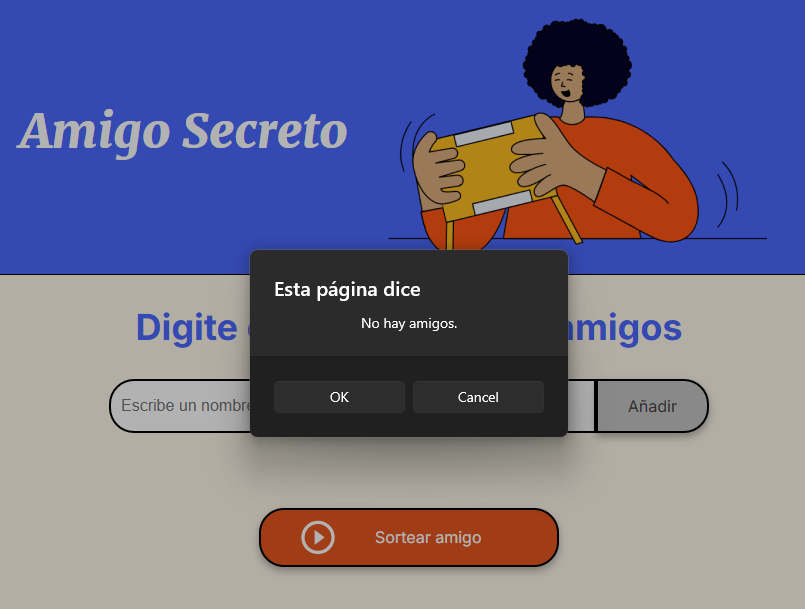
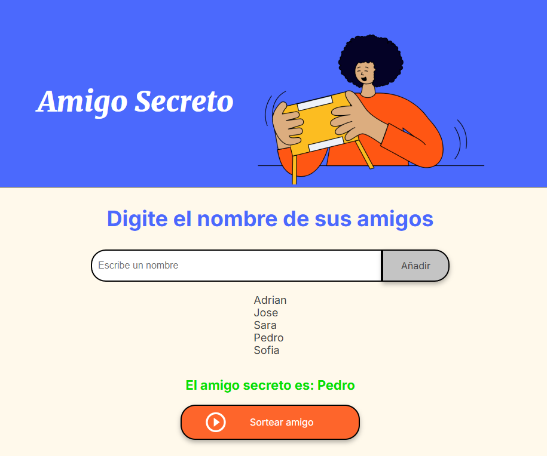

# 🔎 Challenge Amigo Secreto:
Este reto o challenge consiste en aplicar la logica de programación en JavaScript para generar una pagina que diga el amigo secreto ingresando varios nombres.

# 💻 Herramientas y Lenguajes Utilizados:
  

# 📔 Funcionalidades
- Valida que se ingrese texto, si la entrada es vacia muestra una alerta.

- Si no hay amigos agregados, muestra una alerta con dicha información.

- Al oprimir el boton de "Sortear Amigo", elige un nombre al azar de los que se haya ingresado.

# ✅ ¿Que se aprende con este reto?
- El uso de funciones o metodos.
- El Manejo de arreglos (Agregar).
- El control del DOM (controlar inputs, listas, botones, entre otros).

💻  con ❤️ por Adrian Vargas 

